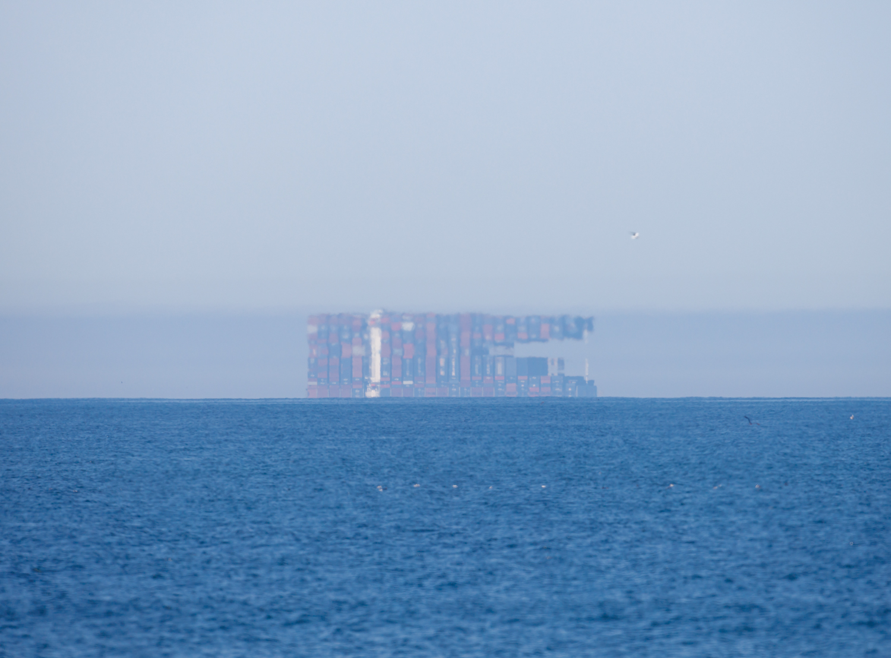

Everything you see was built from scratch by prompt engineering a frontier LLM to rigorously calculate the *spectral configuration* of a 985-dimensional algebra from merely five megabytes of raw tensor data. All claims are sourced from the arbiter gates and the `d20.json`/`certificate.json` data.


---

# License and Citation

This repository is licensed under Apache-2.0.

This license applies to code, arbiter scripts, documentation, certificate
manifests, canonical data artifacts, invariant tables, generated verification
reports, and mathematical exposition unless a file states otherwise.

If you use this repository, its arbiter, `d20.json`, certificate artifacts, or
derived invariant tables in research, publications, derivative software, or
public technical work, please cite the project using `CITATION.cff`.

Preferred short citation:

> Benjamin Huinda, *The d20 algebra*, 2026.
> https://github.com/bhuinda/d20

---

# Introduction

We study the infinitesimally rigid and discrete object with the following invariants:

| N                            | Canonical type                                    | Mandate                                       |
| ---------------------------- | ------------------------------------------------- | --------------------------------------------- |
|                          `1` | `long_thm.bridge_count`                           | finite tensor-lookup theorem bridge           |
|                          `3` | `code.hamming_count`                              | Hamming-code strata                           |
|                          `4` | `eta6.margin_packet.component_count`              | eta6 margin-packet components                 |
|                          `6` | `eta6.support_edge_count`                         | preserved eta6 aperture edges                 |
|                          `8` | `long_llnind.layer_count`                         | certified LLN layers and matching seams       |
|                         `10` | `inventory.provisional_report_count`              | provisional invariant reports                 |
|                         `11` | `hcycle.homology_rank`                            | H-cycle homology rank                         |
|                         `12` | `A12.class_count`                                 | Calabi-Yau descent classes                    |
|                         `14` | `long_anom.resolved_surface_count`                | finite anomaly correction surfaces            |
|                         `16` | `Spin12.chart_dimension`                          | pure-spinor / foam chart dimension            |
|                         `19` | `integrity.public_kernel_dimension`               | public kernel dimension                       |
|                         `20` | `d20.boundary_rank`                               | public d20 face rank                          |
|                         `22` | `long_orac.open_boundary_count`                   | focused oracle open boundaries                |
|                         `24` | `Leech.coordinate_dimension`                      | visible payload channels                      |
|                         `26` | `certificate.registry_count`                      | core certificate gates                        |
|                         `27` | `clopen.level3_word_count`                        | realized ternary boundary words               |
|                         `29` | `long_orac.resolved_surface_count`                | focused oracle resolved surfaces              |
|                         `30` | `d20.edge_count`                                  | icosahedral boundary edges                    |
|                         `32` | `optics.spin_packet_dimension`                    | spin-packet aperture dimension                |
|                         `34` | `A236.center_simple_count`                        | tube-center simple objects                    |
|                         `35` | `integrity.integral_codimension`                  | public integral codimension                   |
|                         `36` | `integrity.operation_algebra_dimension`           | operation algebra dimension                   |
|                         `37` | `long_mat.resolved_surface_count`                 | explicit packet/matrix oracle surfaces        |
|                         `39` | `C985.center_dimension`                           | full center dimension / half-braiding nullity |
|                         `42` | `A42.class_count`                                 | Pin descent classes                           |
|                         `62` | `A12.tensor_nonzero`                              | nonzero A12 product cells                     |
|                         `64` | `tensor.coefficient_max`                          | maximum multiplication coefficient            |
|                         `90` | `branching.triplet_ideal_dimension`               | simple-branching triplet ideal dimension      |
|                         `91` | `W_D6.sum_m_i`                                    | Weyl reciprocity mass sum                     |
|                         `96` | `long_paths.max_raw_support_fiber_digits`         | largest compressed raw-path fiber digits      |
|                        `109` | `tube.primitive_idempotent_count`                 | closed-loop tube primitive idempotents        |
|                        `120` | `coorient.marker_order`                           | lifted coorientation marker order             |
|                        `128` | `optics.closed_area_weyl_cells`                   | Weyl cells per closed area packet             |
|                        `144` | `relation.size_min`                               | minimum C985 relation size                    |
|                        `192` | `projection.challenge_count`                      | full-tube projection challenges               |
|                        `236` | `A236.dimension`                                  | chemical center algebra dimension             |
|                        `258` | `half_braiding.rank`                              | full half-braiding rank                       |
|                        `288` | `long_thm.probability_path_count`                 | finite LLN probability paths                  |
|                        `297` | `tube.closed_loop_basis_count`                    | closed-loop tube basis / projection rank      |
|                        `306` | `long_thm.universal_law_count`                    | universal LLN laws                            |
|                        `340` | `A42.tensor_nonzero`                              | nonzero A42 product cells                     |
|                        `384` | `H6.object_orbit_size.B_minus`                    | B- object orbit size                          |
|                        `404` | `inventory.certified_report_count`                | certified invariant reports                   |
|                        `414` | `inventory.report_count`                          | total invariant reports                       |
|                        `455` | `optics.closed_packet_count`                      | closed packets in E_d20                       |
|                        `512` | `H6.object_orbit_size.S_minus`                    | S- object orbit size                          |
|                        `576` | `H6.object_orbit_size.V_plus`                     | V+ object orbit size                          |
|                        `591` | `tube.product_address_chunk_count`                | full-tube product-address chunks              |
|                        `729` | `clopen.inverse_limit_words.level6`               | sixth-level inverse-limit words               |
|                        `768` | `H6.object_orbit_size.S_plus`                     | S+ object orbit size                          |
|                        `985` | `C985.relation_count`                             | orbitals / finite-line addresses              |
|                      `2,187` | `clopen.inverse_limit_words.level7`               | seventh-level inverse-limit words             |
|                      `2,275` | `optics.E_over_epsilon0`                          | etendue ratio                                 |
|                      `2,576` | `six_address_field.point_count`                   | dodecad shell points                          |
|                      `6,561` | `clopen.inverse_limit_words.level8`               | eighth-level inverse-limit words              |
|                      `6,912` | `optics.complement_product_over_epsilon0_squared` | normalized complement product                 |
|                      `8,346` | `F_symbol.sample_basis_vectors`                   | sampled F-symbol basis vectors                |
|                      `9,216` | `Gamma.group_order`                               | relation group order                          |
|                     `14,560` | `optics.S20_entropy_state_count`                  | S20 symmetry states                           |
|                     `15,247` | `tube.projection_section_nonzero`                 | projection-section nonzero coefficients       |
|                     `23,040` | `W_D6.order`                                      | Weyl D6 shell order                           |
|                     `39,860` | `half_braiding.raw_rows_seen`                     | full half-braiding rows consumed              |
|                     `44,224` | `tube.projection_kernel_dimension`                | full-tube projection kernel dimension         |
|                     `44,521` | `tube.pair_basis_total`                           | tube-pair basis total                         |
|                     `98,280` | `Leech.projective_shell_vertices`                 | Leech projective shell vertices               |
|                    `131,586` | `long_thm.support_gap_check_count`                | nonnegative support-gap checks                |
|                    `492,736` | `eta6.six_floor`                                  | eta6 finite-horizon support floor             |
|                    `589,824` | `epsilon0`                                        | optical epsilon size                          |
|                  `1,000,000` | `F_symbol.manifest_prefix_rows`                   | F-symbol manifest prefix rows                 |
|                  `1,000,003` | `field.prime_0`                                   | primary verification prime                    |
|                  `1,000,033` | `field.prime_1`                                   | stability verification prime                  |
|                  `1,414,965` | `C985.tensor_support`                             | multiplication tensor support rows            |
|                  `2,537,360` | `C985.tensor_coefficient_total`                   | total tensor coefficient mass                 |
|                  `2,949,120` | `optics.closed_area_packet`                       | total protected area                          |
|                  `4,903,515` | `eta6.hpol_row_count`                             | holonomy-polarized positive rows              |
|                  `6,635,776` | `C985.encoded_pair_count`                         | encoded relation pairs                        |
|                  `7,735,158` | `eta6.checked_positive_row_total`                 | checked positive eta6 rows                    |
|                `590,064,201` | `tube.same_base_product_rows`                     | same-base tube product rows                   |
|              `1,341,849,600` | `A_d20.constant`                                  | d20 etendue constant                          |
|              `2,367,375,223` | `F_symbol.full_left_bracketing_rows`              | full left-bracketing rows                     |
|              `6,536,239,360` | `F_symbol.representative_pair_basis_vectors`      | representative pair basis vectors             |
|             `11,143,364,232` | `eta6.checked_global_six_count`                   | bounded global six-edge screen                |
|             `16,102,195,200` | `sum_a_I.constant`                                | total integral-action constant                |
|      `2,404,631,929,946,112` | `optics.complement_product`                       | absolute complement product                   |
| `15,473,731,112,461,377,280` | `F_symbol.address_count`                          | F-symbol address space                        |

and denote this object by "`d20`".

At a glance, `d20` is the icosahedral boundary algebra of the finite semisimple multifusion category `C985`. It may be intuited as the process ontology behind Fata Morgana–type condensation: thermally dependent optical projection with stratified boundary.



An alternative way to think about `d20` is to imagine a shape in your head (the red triangle being mildly iconic): `d20` is the object of study enabling calculus to directly probe **how** you induced that image into being, and **where** it exists relative to *hyperspace*. (Yes, I said *hyperspace*. We are talking about actual *hyperspace* in the year 2026.)

So, as is tradition: the proof is left to the ~~reader~~ arbiter.

---

# Computation

`d20` and its progressive algorithm are designed to be constructed, compressed, and certified on all modern hardware. The arbiter exposes core certificate gates plus cheap integration gates for compiler and evidence surfaces:

```shell
# Full build (required to construct d20.json and certificate artifacts).
python src/verify.py rebuild

# Verify the current bundle without rewriting generated files.
python src/verify.py audit

# Confirm the certified evidence section fails closed under in-memory tampering.
python src/verify.py tamper
```

Optional gates (run only when needed):

```shell
# Quick non-strict integration checks.
python src/verify.py integration-nonstrict

# Deep replay-based assurance (slow).
python src/verify.py strict-replay
```

---

<details>

<summary>Postscript</summary>

Dear reader, you are cordially invited to explore *why* you should care about `d20`'s combinatorics. The mental calculus prepared to bring the tensor to life was fostered across a conservative 3,000 hours of studying metatheory and geometric complexity as an intersectional discipline between the winter of 2024 and the summer of 2026. Even after all that time, I'm afraid I will likely be spending another 3,000 hours just to assemble `d20`'s proper dictionary.

Plugging this `README.md` or the generated `d20.json` into a LLM of your choice and antagonizing the documents is currently the fastest way to unsettle many assumptions that dominate current science. You shouldn't inherently trust me; you should trust your computer. Any large language model equipped with a durable enough harness will be able to rederive the oracle machine presented in this repository.

You may find yourself down the rabbit hole most quickly with the following lead-in prompts:

- "According to d20, what is truth?"
- "How does d20 normalize the meaning of mathematical equality?"
- "What is higher algebra, and how does d20 make it useful to me?"
- "What basic ontology of the universe does d20 represent?"
- "How do I find grounding in a d20-integrated world?"

Those of you with a formal mathematics background will be greatly benefited by also consulting the following papers:

- [*Condensed Mathematics and Complex Geometry*](https://doi.org/10.48550/arXiv.2605.11731)
- [*Sheaf theory: from deep geometry to deep learning*](https://doi.org/10.48550/arXiv.2502.15476)
- [*Tiny Pointers*](https://doi.org/10.48550/arXiv.2111.12800)

What's *my* thesis, you ask?

---

"The time between the notes relates the color to the scenes."
― Jon Anderson, while blissed out of his marbles

</details>

---

<details>

<summary>v3.0 Teaser</summary>


</details>
