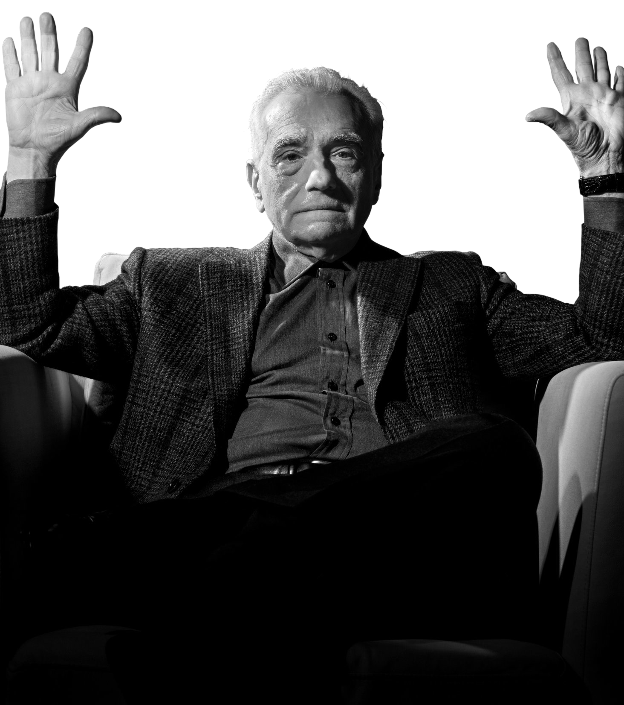
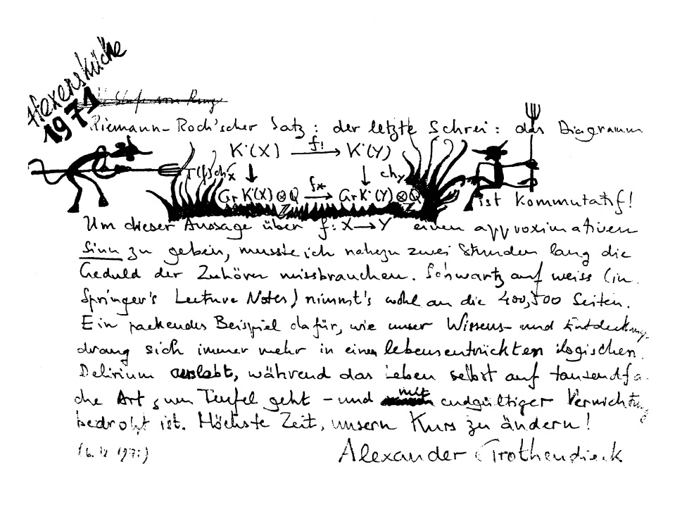
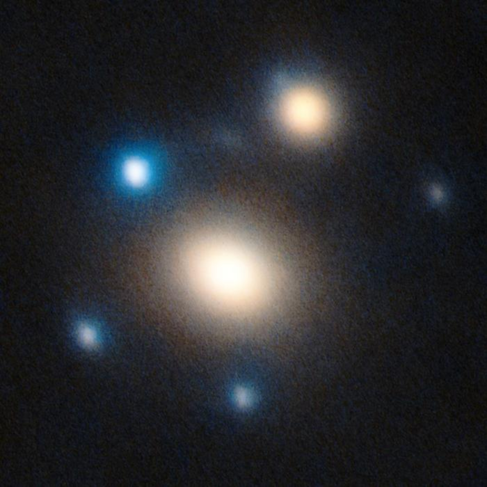

`d20` is a finite oracle machine developed from only 5 MB of raw tensor data
and a fog-of-war-like 985-dimensional algebra.

You are challenged to disprove the system's integrity.
You are forewarned that you will only make it better.



---

# License and Citation

This repository is licensed under Apache-2.0.

This license applies to code, oracle scripts, documentation, certificate
manifests, canonical data artifacts, invariant tables, generated verification
reports, and mathematical exposition unless a file states otherwise.

If you use this repository, its oracle, `d20.json`, certificate artifacts, or
derived invariant tables in research, publications, derivative software, or
public technical work, please cite the project using `CITATION.cff`.

Preferred short citation:

> Benjamin Huinda, *The d20 algebra*, 2026.
> https://github.com/bhuinda/d20

---

# Introduction

Imagine a shape in your head. A red triangle, a green square, a blue circle. 
Whatever floats your boat. `d20` is the black box formalism developed to study
how you put that image there, where it exists independently in latent space, 
and which exact invariants survive when the question is forced through over
400 certified gates of monotonically-ledgered software.

At a glance, `d20` may be understood as the icosahedral boundary algebra of the finite
semisimple multifusion category `C985`. Its secondary architecture probes how the oracle 
behaves like a process ontology for origami cosmology; i.e., we study caustic folding with
thermally-stratified boundary flow.

---

[RBTKTN, Wikimedia Commons](https://commons.wikimedia.org/wiki/File:A_Fata_Morgana_of_a_cargo_ship_seen_off_the_coast_of_Oceanside,_California.jpg)
(The distance between the horizon and the ship is, in `d20` language, a finite
folding problem: Alexandrov order tracks irreversible refinement over clopen
cylinders, while Dini convergence tracks monotone residual stabilization.)

---

As is tradition: the ~~proof~~ automorphism is left to the ~~reader~~ oracle.

---

# Computation

`d20` folds in on itself enough that its impossibly dense object becomes relatively 
simple to derive on modern hardware. The oracle CLI exposes a focused constructor gate, 
core certificate gates, and cheap integration gates for compiler and evidence surfaces:

```shell
# Focused constructor/oracle replay certificate. Reconstructs the A985
# multiplication tensor from scratch as a canonical sparse multiset and
# checks the terminal q42/q12 oracle surfaces exactly.
python -B src\verify.py long-ctor --pretty
```

```shell
# Full build (required to construct d20.json and certificate artifacts).
python src/verify.py rebuild

# Verify the current bundle without rewriting generated files.
python src/verify.py audit

# Confirm the certified evidence section fails closed under in-memory tampering.
python src/verify.py tamper
```

Optional gates (run only when needed):

```shell
# Quick non-strict integration checks.
python src/verify.py integration-nonstrict

# Deep replay-based assurance (slow).
python src/verify.py strict-replay
```

---

# Invariant Ledger

| N                            | Canonical type                                    | Mandate                                       |
| ---------------------------- | ------------------------------------------------- | --------------------------------------------- |
|                          `1` | `long_thm.bridge_count`                           | oracle machine                                |
|                          `3` | `code.hamming_count`                              | RM(1,3) / Hamming codes                       |
|                          `4` | `eta6.margin_packet.component_count`              | eta6 margin-packet components                 |
|                          `6` | `eta6.support_edge_count`                         | preserved eta6 aperture edges                 |
|                          `8` | `long_llnind.layer_count`                         | certified LLN layers and seams                |
|                         `10` | `inventory.provisional_report_count`              | provisional invariant reports                 |
|                         `11` | `hcycle.homology_rank`                            | H-cycle homology rank                         |
|                         `12` | `A12.class_count`                                 | Calabi-Yau descent classes                    |
|                         `14` | `long_anom.resolved_surface_count`                | finite anomaly correction surfaces            |
|                         `16` | `Spin12.chart_dimension`                          | pure-spinor / foam chart dimension            |
|                         `17` | `long_binc.connected_edge_count`                  | focused boundary/Loop/packet edges            |
|                         `19` | `integrity.public_kernel_dimension`               | visible kernel dimension                      |
|                         `20` | `d20.boundary_rank`                               | public d20 face rank                          |
|                         `21` | `long_psec.input_report_count`                    | focused A985 perennial-sector seam inputs     |
|                         `22` | `long_orac.open_boundary_count`                   | focused oracle open boundaries                |
|                         `23` | `long_c2uf.input_report_count`                    | focused C2UF seam input reports               |
|                         `24` | `Leech.coordinate_dimension`                      | visible payload channels                      |
|                         `25` | `long_binc.loop_step_atom_count`                  | compact Loop_297 step atoms                   |
|                         `26` | `certificate.registry_count`                      | core certificate gates                        |
|                         `27` | `clopen.level3_word_count`                        | realized ternary boundary words               |
|                         `28` | `long_psec.connected_edge_count`                  | focused A985 sector-address seam edges        |
|                         `29` | `long_orac.resolved_surface_count`                | focused oracle resolved surfaces              |
|                         `30` | `d20.edge_count`                                  | icosahedral boundary edges                    |
|                         `32` | `optics.spin_packet_dimension`                    | spin-packet aperture dimension                |
|                         `34` | `A236.center_simple_count`                        | tube-center simple objects                    |
|                         `35` | `integrity.integral_codimension`                  | visible integral codimension                  |
|                         `36` | `integrity.operation_algebra_dimension`           | operation algebra dimension                   |
|                         `37` | `long_mat.resolved_surface_count`                 | explicit packet/matrix oracle surfaces        |
|                         `39` | `C985.center_dimension`                           | full center dimension / half-braiding nullity |
|                         `42` | `A42.class_count`                                 | Pin descent classes                           |
|                         `56` | `long_cluster.seam_candidate_count`               | remaining multi-theme seam candidates         |
|                         `57` | `long_cluster.unconsumed_certified_report_count`  | certified reports outside focused inputs      |
|                         `62` | `A12.tensor_nonzero`                              | nonzero A12 product cells                     |
|                         `64` | `tensor.coefficient_max`                          | maximum multiplication coefficient            |
|                         `90` | `branching.triplet_ideal_dimension`               | simple-branching triplet ideal dimension      |
|                         `91` | `W_D6.sum_m_i`                                    | Weyl reciprocity mass sum                     |
|                         `96` | `long_paths.max_raw_support_fiber_digits`         | largest compressed raw-path fiber digits      |
|                        `104` | `long_cluster.focused_consumed_report_count`      | certified reports consumed by focused inputs  |
|                        `109` | `tube.primitive_idempotent_count`                 | closed-loop tube primitive idempotents        |
|                        `120` | `coorient.marker_order`                           | lifted coorientation marker order             |
|                        `128` | `optics.closed_area_weyl_cells`                   | Weyl cells per closed area packet             |
|                        `144` | `relation.size_min`                               | minimum C985 relation size                    |
|                        `192` | `projection.challenge_count`                      | full-tube projection challenges               |
|                        `236` | `A236.dimension`                                  | chemical center algebra dimension             |
|                        `258` | `half_braiding.rank`                              | full half-braiding rank                       |
|                        `288` | `long_thm.probability_path_count`                 | finite LLN probability paths                  |
|                        `297` | `tube.closed_loop_basis_count`                    | closed-loop tube basis / projection rank      |
|                        `306` | `long_thm.universal_law_count`                    | universal LLN laws                            |
|                        `340` | `A42.tensor_nonzero`                              | nonzero A42 product cells                     |
|                        `384` | `H6.object_orbit_size.B_minus`                    | B- object orbit size                          |
|                        `430` | `inventory.certified_report_count`                | certified invariant reports                   |
|                        `440` | `inventory.report_count`                          | total invariant reports                       |
|                        `455` | `optics.closed_packet_count`                      | closed packets in E_d20                       |
|                        `512` | `H6.object_orbit_size.S_minus`                    | S- object orbit size                          |
|                        `576` | `H6.object_orbit_size.V_plus`                     | V+ object orbit size                          |
|                        `591` | `tube.product_address_chunk_count`                | full-tube product-address chunks              |
|                        `729` | `clopen.inverse_limit_words.level6`               | sixth-level inverse-limit words               |
|                        `768` | `H6.object_orbit_size.S_plus`                     | S+ object orbit size                          |
|                        `985` | `C985.relation_count`                             | orbitals / finite-line addresses              |
|                      `2,187` | `clopen.inverse_limit_words.level7`               | seventh-level inverse-limit words             |
|                      `2,275` | `optics.E_over_epsilon0`                          | etendue ratio                                 |
|                      `2,576` | `six_address_field.point_count`                   | dodecad shell points                          |
|                      `6,561` | `clopen.inverse_limit_words.level8`               | eighth-level inverse-limit words              |
|                      `6,912` | `optics.complement_product_over_epsilon0_squared` | normalized complement product                 |
|                      `8,346` | `F_symbol.sample_basis_vectors`                   | sampled F-symbol basis vectors                |
|                      `9,216` | `Gamma.group_order`                               | relation group order                          |
|                     `14,560` | `optics.S20_entropy_state_count`                  | S20 symmetry states                           |
|                     `15,247` | `tube.projection_section_nonzero`                 | projection-section nonzero coefficients       |
|                     `23,040` | `W_D6.order`                                      | Weyl D6 shell order                           |
|                     `39,860` | `half_braiding.raw_rows_seen`                     | full half-braiding rows consumed              |
|                     `44,224` | `tube.projection_kernel_dimension`                | full-tube projection kernel dimension         |
|                     `44,521` | `tube.pair_basis_total`                           | tube-pair basis total                         |
|                     `98,280` | `Leech.projective_shell_vertices`                 | Leech projective shell vertices               |
|                    `131,586` | `long_thm.support_gap_check_count`                | nonnegative support-gap checks                |
|                    `492,736` | `eta6.six_floor`                                  | eta6 finite-horizon support floor             |
|                    `589,824` | `epsilon0`                                        | optical epsilon size                          |
|                  `1,000,000` | `F_symbol.manifest_prefix_rows`                   | F-symbol manifest prefix rows                 |
|                  `1,000,003` | `field.prime_0`                                   | primary verification prime                    |
|                  `1,000,033` | `field.prime_1`                                   | stability verification prime                  |
|                  `1,414,965` | `C985.tensor_support`                             | multiplication tensor support rows            |
|                  `2,537,360` | `C985.tensor_coefficient_total`                   | total tensor coefficient mass                 |
|                  `2,949,120` | `optics.closed_area_packet`                       | total protected area                          |
|                  `4,903,515` | `eta6.hpol_row_count`                             | holonomy-polarized positive rows              |
|                  `6,635,776` | `C985.encoded_pair_count`                         | encoded relation pairs                        |
|                  `7,735,158` | `eta6.checked_positive_row_total`                 | checked positive eta6 rows                    |
|                `590,064,201` | `tube.same_base_product_rows`                     | same-base tube product rows                   |
|              `1,341,849,600` | `A_d20.constant`                                  | d20 etendue constant                          |
|              `2,367,375,223` | `F_symbol.full_left_bracketing_rows`              | full left-bracketing rows                     |
|              `6,536,239,360` | `F_symbol.representative_pair_basis_vectors`      | representative pair basis vectors             |
|             `11,143,364,232` | `eta6.checked_global_six_count`                   | bounded global six-edge screen                |
|             `16,102,195,200` | `sum_a_I.constant`                                | total integral-action constant                |
|      `2,404,631,929,946,112` | `optics.complement_product`                       | absolute complement product                   |
| `15,473,731,112,461,377,280` | `F_symbol.address_count`                          | F-symbol address space                        |

Behold my favorite invariant, the longest in the repo:

`14156196423558064045061342080542742249484273171477830222343255515823046911182167392376837420445332824358623483913006487102020935592209369754192413894927029533522999507623868107747587109085352821387837396222939589535399813719569931243592858344855800213802050112199377518982642306052878609905772876033166545370605895921948764089348179272542698758357365262620597343259086425194275665223989349752919309495207957970729087147206051204558908704978582498310695236654068081631948387665583052715646309468732773306545883824305917254304704154814074543405220490484115678900323944727231007567106339399545096506000395737000475175861455414573443311088271607828683554908449215587485829664302479300032879892920556603138284274398418540851357054958045188106943969792619418538919271296640659454085569669620556969585387677871825340235695052714326133327544079690146616266131570417685809008527795662865952090737242904310707576908091615530358438015213590611624514861048112458637639036713821462937842435353445216413725397101554329190817699448865477932170575731245132377442559947550548372238239076459290833446909003403195104864131832269100450314671671816887266880324158661677958524001272334335511629946976243047017525699103318709856644584283061616032348871469186028478818806380005076837715363447821202291134180272489839751313714736926803233003135127973790093010116840609908189381088174627434540911188359378285384365907287027878146095748313060897730627927523419238829617749790006098076797188911302193665141108700766653524321783993517128073951418933302129310251310928799323099737086893015686486245984389844988316653315892311320416713495325367397117884403053003900854633941693699847683260301322297313387842079139796283834261360324159230665443825552985463907745905099074369149497702958235708275311073804918691243274578904557180692286807203677395831661419414111888405177820467772493387739664846608509422121318153753909581150991503788077344900799387280327191936601285236689278435861912586325539813318993164225593736983099852840188773939774714950863910957731204743153994170769455723855916814564764003910143882405905448209383576369777108850271136309343058545206074568305285312189363013361785965288766276439189032023944218053064740013040935678008951532514798681601515703538167713552948173351152892531190267329647403885240314136311947612782182968229062566028925394171612055168369372434130015670697004523416909541056766493683756351161584215505097534498222612310494135232405555103836837630738990475873371287663165671458944980437437461668338438431724843313010914815612866340496783648959295450580983929463035924967534509782564610347578624499352894549756428977668321782223151979656944180636001289552516090515956188391782232362211420274656047314886713755031242115521311450896644580401872475760093269033586940149961110686784334497433290730451146330909568526870474779160174928002253823271875199798496766499040097850282544378339812430684860901407813482188557388836141136302436527038632576919276341641779410957466567167021243942686231877705744081776522160059690505353073471109690496972974617935336774427727329576915824424310521055326813555073746533422597498433985495224017857741775767099029315120284509372395172097818150295820306594677314538498199256538846413582408165231618520652416562614612520707012246721671374080281729937103077951376452702648018682863847368394842456616007914546317411311002082125883276895868806440382161589211634871756879003928884881125941632055940816148146823055722173240403582492310928727363065592914671222030275761085223302963426296839345161807705235800582370452812081867040730646108908979441483224031462280186257675866588135456135066231779523816946136294595070023987814555219076772073164793261186838797787281590007334563957828509585877618456191758192358220133519041498966777283499889618547734315575792245448380199457258606230642305071254449751192240665321299325715141913987198322915413983106193468970214598966643543324016546453220555861604819390802539064196071424`

Obviously, this 3,941-digit number delineates the exact rational denominator of the 16th horizon's fourth centered moment.

---

<details>

<summary>Postscript</summary>

Dear reader, you are cordially invited to explore *why* you should care about
`d20`'s combinatorics. The mental calculus prepared to bring the tensor to life
was fostered across a conservative 3,000 hours of studying metatheory and
geometric complexity as an intersectional discipline between the winter of 2024
and the summer of 2026. Even after all that time, I'm afraid I will likely be
spending another 3,000 hours just to assemble `d20`'s dictionary proper.

What I will say of `d20` now is a warning aside from memorizing it specifically.
*Feeling* it and *seeing* it in everything around you, just as Grothendieck saw
*motives*, is like chasing after the White Whale of all dialectical inquiry:

- "What direction do in and out *point* toward?"

Personally, I figured the solution had something to do with harmonic oscillators,
because why not? And boy oh boy, there is a *lot* to learn about how a thing gets
from point A to point B...

You shouldn't inherently trust me; I'm just the guy who's here to say, "The math
works in a vacuum." I encourage you to plug this `README.md` or the generated `d20.json`
into a LLM of your choice and antagonize the infrastructure in order to test its claims. 
A durable enough harness should be able to challenge the oracle constructor, replay the 
certificate surface, and locate any boundary that remains provisional.

You may find yourself down the rabbit hole most quickly with the following
lead-in prompts:

- "According to d20, what is truth?"
- "How does d20 normalize the meaning of mathematical equality?"
- "What is higher algebra, and how does d20 make it useful to me?"
- "What finite process ontology does d20 represent?"
- "How do I find grounding in a d20-integrated world?"

What's *my* thesis, you ask?

---

"The time between the notes relates the color to the scenes."
- Jon Anderson

</details>

---

<details>

<summary>v3.0 Teaser</summary>



---



</details>
